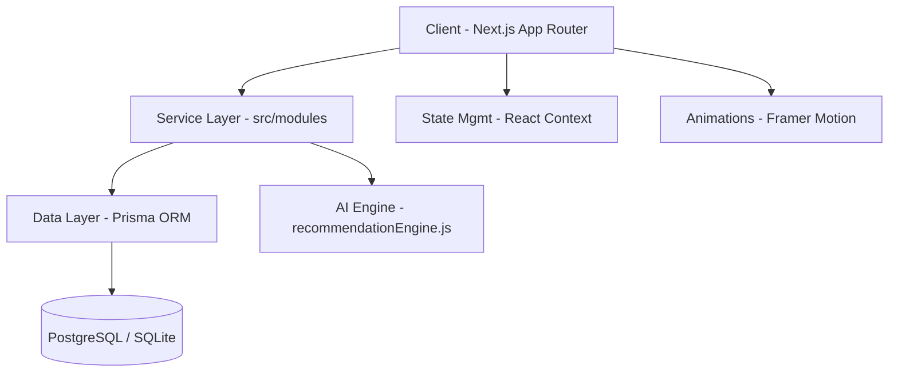

# MAISON NOIR — Archival Excellence
[](https://nextjs.org/)
[](https://www.prisma.io/)
[](https://developer.mozilla.org/en-US/docs/Web/CSS)
[](LICENSE)

### Ultra-Premium Architectural Fashion & Custom Horology

Maison NOIR is a production-grade, high-fidelity luxury e-commerce ecosystem. It leverages modern full-stack patterns to deliver a cinematic user experience while maintaining a robust, scalable backend architecture.

---

## 📑 Table of Contents
- [Architecture Overview](#-architecture-overview)
- [Key Features](#-key-features)
- [Tech Stack](#-tech-stack)
- [Performance & Optimization](#-performance--optimization)
- [Getting Started](#-getting-started)
- [Environment Configuration](#-environment-configuration)
- [The Concierge](#-the-concierge)

---

## 🏛️ Architecture Overview
Maison NOIR follows a modern decoupled architecture with a centralized service layer for business logic.



---

## ✨ Key Features

### 🤖 Intelligent Personalization
- **AI Stylist**: A real-time recommendation engine that analyzes user behavior and discovery patterns to suggest archival pieces.
- **Discovery Observer**: A silent observer component that tracks user engagement without compromising performance.

### 👗 Advanced Commerce
- **Interactive Outfit Builder**: A complex state-managed UI allowing users to layer garments and visualize silhouettes.
- **Bespoke Fragrance Lab**: A specialized product configuration engine for custom scents and bottle engraving.
- **Dynamic Cart Logistics**: Features high-fidelity cart drawers with cross-selling reminders and persistence.

### 📽️ Cinematic UI/UX
- **Smooth Navigation**: Custom `SmoothScrollProvider` for a high-end, tactile feel.
- **Responsive Mastery**: Fluid layouts that transition seamlessly from desktop showroom to mobile boutique.

---

## 🛠️ Tech Stack

| Layer | Technology |
| :--- | :--- |
| **Frontend** | Next.js 14 (App Router), React 18, Framer Motion |
| **Styling** | Vanilla CSS (BEM-inspired), CSS Variables, Lucide Icons |
| **Backend** | Next.js API Routes, Node.js |
| **Database** | Prisma ORM (Relational Mapping), PostgreSQL/SQLite |
| **Auth** | Custom AuthProvider (Extensible to NextAuth) |
| **Deployment** | Vercel Optimized |

---

## ⚡ Performance & Optimization
- **Image Optimization**: Utilizing `next/image` with custom loaders and Unsplash source verification.
- **Font Strategy**: Localized Google Fonts via `next/font` to eliminate layout shift (CLS).
- **Metadata Management**: Dynamic SEO orchestration using the Next.js Metadata API for maximum visibility.
- **Hydration Safety**: Custom `suppressHydrationWarning` strategies for third-party integrations.

---

## 🚀 Getting Started

### Prerequisites
- Node.js 18.x or higher
- Git

### Installation
1. **Clone the repository:**
   ```bash
   git clone https://github.com/GodlLuffy/NOIR-1.git
   cd NOIR-1
   ```
2. **Install dependencies:**
   ```bash
   npm install
   ```
3. **Database Setup:**
   Configure your `.env` (see below) and run:
   ```bash
   npx prisma generate
   npx prisma db push
   npx prisma seed
   ```
4. **Run Development Server:**
   ```bash
   npm run dev
   ```

---

## 🔑 Environment Configuration
Create a `.env` file in the root directory:
```env
DATABASE_URL="file:./dev.db" # Or your PostgreSQL string
NEXTAUTH_SECRET="your-secret-here"
NEXT_PUBLIC_APP_URL="http://localhost:3000"
```

---

## 📧 The Concierge
For technical deep-dives or bespoke inquiries:

- **Electronic Mail**: [Gundelwaranup119@gmail.com](mailto:Gundelwaranup119@gmail.com)
- **Concierge Direct**: 9226408230
- **Studio**: 42 Archive Blvd, Level 10, Mumbai, MH 400001

---

*© 2024 Maison NOIR. Designed with precision. Built with passion.*


