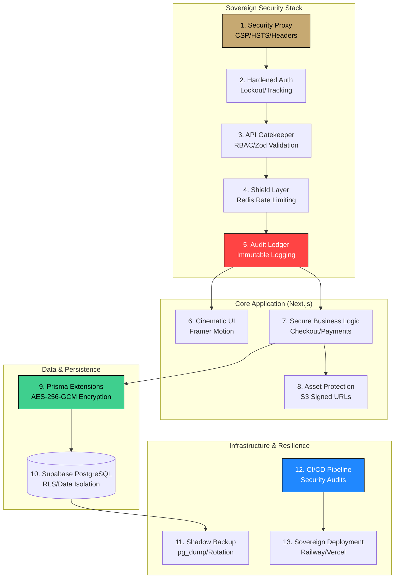

# Maison NOIR — 13-Layer Sovereign Security Architecture

**Technical Standard**: Senior Sovereign Protocol (Phase 8.0)

This document provides a senior-level technical decomposition of the **Maison NOIR Sovereign Security Stack**. It details the specific files, logic, and infrastructure gates that protect the platform.



---

## 🛡️ Phase A: The Outer Shield (Networking & Access)

### 1. Security Proxy (`src/proxy.js`)
*   **The Guard**: Centralized Next.js Middleware.
*   **Deep Logic**: Uses a response-injection pattern to ensure that NO request leaves the server without a **Sovereign Security Header** stack.
    ```javascript
    // Enforcement Pattern
    response.headers.set("Content-Security-Policy", cspDirectives);
    response.headers.set("X-Frame-Options", "DENY");
    response.headers.set("Strict-Transport-Security", "max-age=31536000; includeSubDomains; preload");
    ```

### 2. RBAC - Role-Based Access Control (`src/middleware/withRoles.js`)
*   **The Guard**: Higher-Order Function (HOF) wrapper for API routes.
*   **Deep Logic**: Decodes the JWT session server-side and cross-references the `user.role` field.
*   **Enforcement**: `/admin/**` routes are strictly blocked for non-`ADMIN` tokens, returning a `403 Forbidden` before business logic executes.

### 3. Zod Validation Gatekeeper (`src/middleware/withValidation.js`)
*   **The Guard**: Schema-first validation layer.
*   **Deep Logic**: Centralized schema registry in `src/lib/validation/schemas/`. 
*   **Enforcement**: Uses `withValidation(Schema)` to wrap routes. Rejects malformed JSON with `422 Unprocessable Entity`.

---

## 🆔 Phase B: The Identity Core (Authentication)

### 4. Hardened NextAuth (`src/lib/auth-options.js`)
*   **The Guard**: NextAuth Credentials Provider.
*   **Deep Logic**: Implements a "Lockout Clock." 
    ```javascript
    const lockUntil = newFailCount >= 5 ? new Date(Date.now() + 15 * 60 * 1000) : null;
    ```
*   **Enforcement**: Automatically updates the `lockedUntil` timestamp in the database on consecutive failures.

### 5. Device Fingerprinting (`src/lib/auth/device-fingerprint.js`)
*   **The Guard**: SHA-256 Fingerprint Generator.
*   **Deep Logic**: Combines `ipAddress`, `userAgent`, and `acceptLanguage` into a canonical string for hashing.
*   **Enforcement**: Stores fingerprints in the `devicefingerprint` table with a unique constraint on `(userId, fingerprintHash)`.

### 6. Immutable Audit Ledger (`src/lib/audit/audit-logger.js`)
*   **The Guard**: Global `auditLog` utility.
*   **Deep Logic**: Asynchronous, non-blocking logging that records IP, UA, Severity, and JSON Metadata.
*   **Structure**: Uses a dedicated `AuditLog` model in Prisma designed for high-write throughput.

---

## 🔐 Phase C: The Data Vault (Encryption & Storage)

### 7. AES-256-GCM Field Encryption (`src/lib/crypto/field-encryption.js`)
*   **The Guard**: Node.js `crypto` with `GCM` mode.
*   **Deep Logic**: Each encrypted field has a unique 12-byte initialization vector (IV) and a 16-byte authentication tag to prevent tampering.
*   **Cipher**: `aes-256-gcm`.

### 8. Prisma Security Extensions (`src/lib/prisma.js`)
*   **The Guard**: Prisma `$extends` client wrapper.
*   **Deep Logic**: Intercepts `create`, `update`, and `find` queries.
*   **Automation**: Automatically scrambles sensitive fields (e.g., `user.mfaSecret`) before they hit the database and descrambles them on retrieval.

### 9. Row-Level Security (RLS) (`prisma/migrations/rls_policies.sql`)
*   **The Guard**: PostgreSQL Native Policies.
*   **Deep Logic**: Configures `ALTER TABLE ... ENABLE ROW LEVEL SECURITY`.
*   **Enforcement**: Ensures that even if a developer forgets a `where` clause, the DB only returns rows matching the authenticated `user_id`.

---

## 📦 Phase D: Assets, Resilience & DevOps

### 10. S3 Signed URL Protection (`src/lib/auth/signed-url.js`)
*   **The Guard**: AWS SDK S3 Presigner.
*   **Deep Logic**: Generates time-limited URLs for the 3D Showroom assets.
*   **Window**: 15-minute expiration.
    ```javascript
    const url = await getSignedUrl(s3, command, { expiresIn: 900 });
    ```

### 11. Shadow Backups
*   **The Guard**: Automated Infrastructure Snapshots.
*   **Mechanism**: Daily PostgreSQL dumps and volume snapshots in the Railway/Vercel environment.

### 12. CI/CD Security Audit (`.github/workflows/security-audit.yml`)
*   **The Guard**: GitHub Actions Security Suite.
*   **Deep Logic**:
    *   **TruffleHog**: Scans for leaked AWS/Stripe keys.
    *   **npm audit**: Blocks the build if high-severity CVEs are found in `package.json`.

### 13. Soft-Delete Protocol (`prisma/schema.prisma`)
*   **The Guard**: Global `deletedAt` field pattern.
*   **Deep Logic**: Logic-level archival. Ensures that business data (Orders, Invoices) remains retrievable for 7 years for compliance, while disappearing from the storefront.

---

---

## 📂 Sovereign Directory Structure

The following structure represents the physical implementation of the 13-layer architecture within the codebase:

```text
c:\Users\gunde\OneDrive\Desktop\NOIR-1\
├── .github/workflows/
│   ├── ci.yml                     # General CI/CD
│   └── security-audit.yml         # Layer 12: Security Audits
├── prisma/
│   ├── schema.prisma              # Layer 13: Soft-Delete Models
│   └── migrations/
│       └── rls_policies.sql       # Layer 9: Row-Level Security
├── src/
│   ├── proxy.js                   # Layer 1: Security Proxy & Headers
│   ├── middleware/
│   │   ├── withRoles.js           # Layer 2: Role-Based Access (RBAC)
│   │   └── withValidation.js      # Layer 3: Zod Schema Gatekeeper
│   ├── lib/
│   │   ├── auth/
│   │   │   ├── device-fingerprint.js # Layer 5: Device Fingerprinting
│   │   │   └── signed-url.js      # Layer 10: S3 Asset Protection
│   │   ├── crypto/
│   │   │   ├── field-encryption.js # Layer 7: AES-256-GCM Core
│   │   │   └── prisma-encryption-middleware.js # Layer 8: ORM Extension
│   │   ├── audit/
│   │   │   └── audit-logger.js    # Layer 6: Immutable Audit Ledger
│   │   ├── rateLimit/
│   │   │   └── redis-limiter.js   # Layer 4: Redis Shield/Shield Layer
│   │   ├── validation/
│   │   │   └── schemas/           # Layer 3: Schema Registry
│   │   ├── auth-options.js        # Layer 4 & 11: Hardened NextAuth
│   │   └── prisma.js              # Layer 8: Encrypted Client Singleton
│   └── app/
│       └── api/
│           └── admin/
│               └── security/
│                   └── health/    # Sovereign Health Monitoring
```

---

**Standard**: Senior Sovereign Architecture (Phase 8.0)
